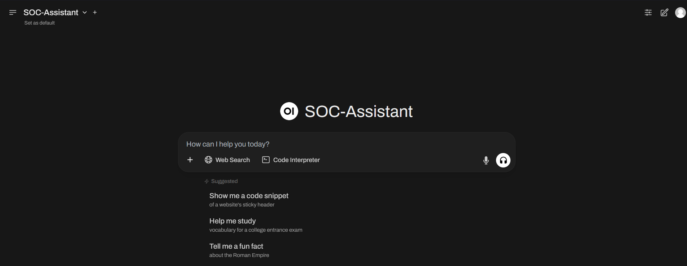
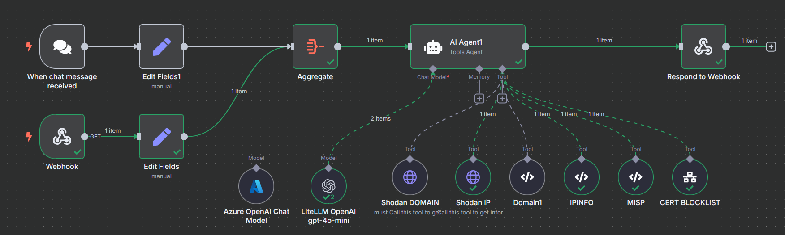
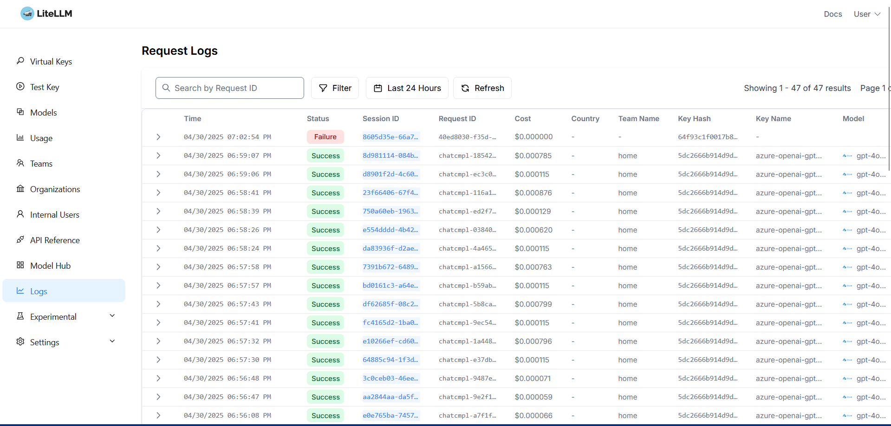
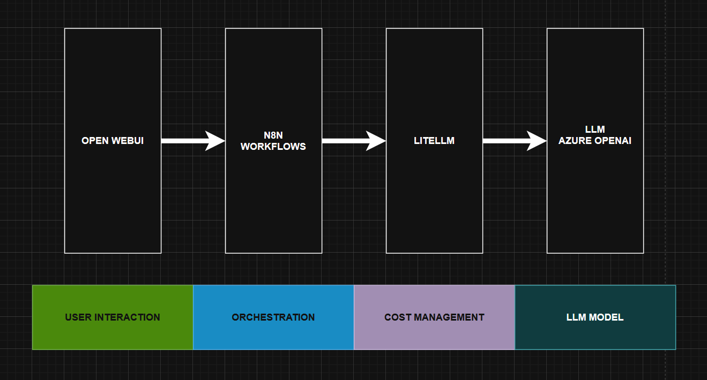

# 🛡️ SOC Assistant

**SOC Assistant**  
AI-Augmented Threat Intelligence Automation for Security Operations Centers  

SOC Assistant is a cutting-edge, AI-enhanced automation platform built to accelerate and simplify investigations within modern Security Operations Centers (SOCs). By integrating conversational AI, modular automation, and real-time threat intelligence, it transforms raw indicators into actionable insights — efficiently and intelligently.

🔬 Built for the AI Hackathon — professional, open, and optimized for sustainable security innovation.

---

**Purpose**  
To empower SOC analysts with real-time, AI-driven enrichment of suspicious indicators such as IPs or domain names, allowing faster triage and smarter response.

**Interface**  
At the core of the user experience is **OpenWebUI**, a sleek, conversational interface that accepts user input and triggers investigations via built-in functions. When an IOC is submitted, the interface securely calls a webhook tied to a backend workflow system.

**Automation Engine**  
The backend uses **n8n**, a powerful low-code workflow engine, to manage the logic of the investigation. Upon receiving input, a specialized AI-driven workflow is triggered. Most of tools — such as threat intelligence lookups or blocklist checks — are implemented as a modular sub-workflow. For instance, the system includes a dedicated integration with the **CERT Polska Blocklist**, implemented as an independent component for easy reuse or customization.

**LLM Integration**  
AI reasoning is handled through **LiteLLM**, a flexible LLM router that supports multiple providers and endpoints. This allows the system to manage cost, performance, and reliability while abstracting away complexity from the analyst. LiteLLM can route requests to multiple backends, and intelligently switch between models or regions.

**Cloud Scalability**  
The preferred AI backend is the **Azure OpenAI Endpoint**, deployed using **Azure AIFoundry**. This setup ensures enterprise-grade performance, security, and elasticity — allowing the LLM capacity to grow as needed without infrastructure changes. The Azure integration also provides seamless scaling and compliance with organizational policies.

**Private Endpoint**  
For environments requiring maximum privacy and compliance, SOC Assistant supports the use of a custom **Ollama** endpoint. This allows you to run all LLM-powered workflows and data processing **locally**, entirely within your own infrastructure. By keeping sensitive workloads on-premises, you maintain full control over data flow, ensuring adherence to internal security policies and the highest standards of privacy.

**Design Philosophy**  
SOC Assistant was developed with a focus on modularity, transparency, and ethical design. It does not attempt to replace human analysts, but rather to augment them — speeding up routine tasks, surfacing meaningful context, and enabling faster, data-driven decisions. Whether deployed in a hackathon prototype or an enterprise SOC lab, SOC Assistant is built to be open, composable, and future-ready.

---

## 🖥️ Project Showcase

> 📸 Interface Preview  
> 

> 📊 Workflow Visualization  
> 

> 📊 LiteLLM Visualization  
> 

---

## 🚀 Key Components

### 🔹 OpenWebUI
Modern web interface for intuitive, chat-style interaction with the SOC Assistant. Analysts input IOCs, ask questions, and view enriched results in real time.

>https://github.com/open-webui/open-webui

### 🔹 n8n + AI Agent
The heart of the system. A dynamic, AI-powered workflow that handles:

- IOC parsing
- Tool orchestration
- Decision-making based on context
- Report summarization
  
> https://github.com/n8n-io/n8n

### 🔹 LiteLLM
Handles routing of prompts to Azure OpenAI endpoints, with built-in cost tracking and fallback logic.

> https://github.com/BerriAI/litellm

### 🔹 Azure AI Foundry | Azure OpenAI Service
Scalable, secure LLM hosting using enterprise-grade models like GPT-4. Ensures data privacy and high performance for security workflows.

---

## 🧠 How It Works

1. **Enter IP/domain in OpenWebUI**
2. **custom n8n workflowis executed**
3. **AI agent is executing suitable tools**
4. **Connected tools perform analysis**:
   - 🔍 **Shodan** – Internet exposure
   - 🧠 **MISP** – Threat intelligence
   - 🧰 **More CTI tools** (extendable)

5. **AI summarizes results**, correlates intelligence, and provides action-oriented insights

---

## 📐 Architecture Diagram

> 

## 📝 TODO List

The following items are currently under development or planned for future enhancements. Community contributions are welcome!

### 🧩 Core Functionalities

- [ ] **Multi-IOC Handling**
  - Accept and process multiple IPs, domains, or hashes within a single chat session.
  - Generate both batch-level summaries and detailed per-IOC breakdowns.
  - Integrate hash analysis tools for malware correlation.
  - Implement website screenshotting tools for URL-based IOCs.

- [ ] **File Analysis Capabilities**
  - Integrate sandbox environments (e.g., **Cuckoo**, **Any.Run**) for dynamic malware analysis.
  - Support email header parsing and metadata extraction.
  - Perform YARA rule matching for malware signature detection.
  - Support SIGMA rule validation for behavioral detection in SIEM-like contexts.

- [ ] **Censys, VirusTotal, and Other Integrations**
  - Query **Censys APIs** for internet-facing asset visibility and service fingerprinting.
  - Extend enrichment via **VirusTotal**, **AbuseIPDB**, and other CTI platforms.
  - Present alternative views to tools like Shodan for improved correlation and coverage.

- [ ] **Single Tool Request Mode**
  - Allow users to selectively run a single enrichment or analysis tool (e.g., "Only run MISP").
  - Improve precision, performance, and response time for focused investigations.

- [ ] **RAG-Based SOC Procedure Assistant**
  - Add a user-friendly interface for ingesting internal procedures from PDF, DOCX, and other document formats.
  - Implement a Retrieval-Augmented Generation (RAG) workflow to interpret these documents and execute investigation steps aligned with institutional SOC playbooks.

---

### ⚡ Let's make our work faster, smarter, and more efficient — with AI.
